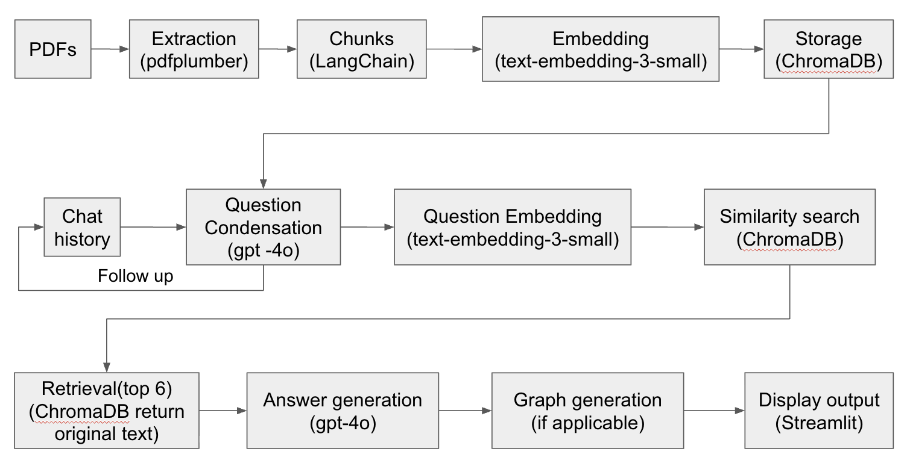

# Car Financial RAG

A Retrieval-Augmented Generation (RAG) chatbot for automotive sector annual reports (BMW, Ford, Tesla).

## Architecture



## Local Setup

```bash
cd car-financial-rag
python -m venv .venv && source .venv/bin/activate
pip install -r requirements.txt

# Create .env
cp .env.example .env
# Edit .env and add your OPENAI_API_KEY

# Run the app
.venv/bin/streamlit run app.py
```

The app will be available at `http://localhost:8501`.

## Docker Setup

```bash
# Set your key in the environment
export OPENAI_API_KEY=sk-...

# Build and run
docker compose up --build
```

The app will be available at `http://localhost:8501`.
